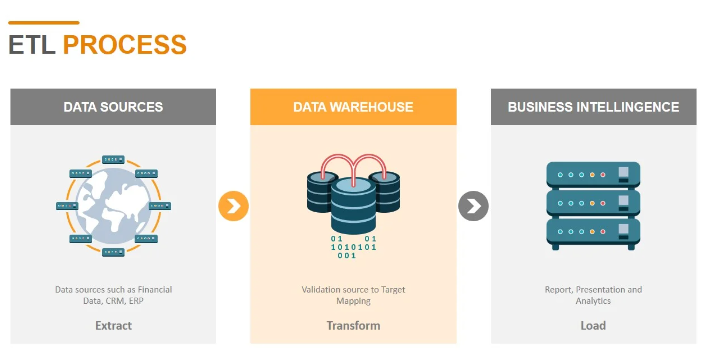

# project-2-group-13

## About the Project

Project 2 is an Extract, Transform, and Load pipeline project. The team members include Andrew Vick, Elizabeth Viramontes, and Sarah Ruth. We built an ETL pipeline using Excel files and starter code that were provided. The project started with the team reviewing the materials and creating an ERD diagram and schema using the QuickDBD tool. Then we extracted the data from the Excel files, transformed the data into dataframes, and saved them off as CSV files. The schema and CSV files were loaded into PosgreSQL to create the Crowdfunding database. Finally, we were able to write queries and generate visualizations.
Our official writeup contains our database design, ETL code overview, analysis, visualizations, Bias and Limitation, and conclusion.

## Built In

Built in Python, Jupyter Notebook and PosgreSQL(PgAdmin) using pandas, numpy, datetime, Json, SQLalchemy, matplotlib, seaborn, and scipy.
